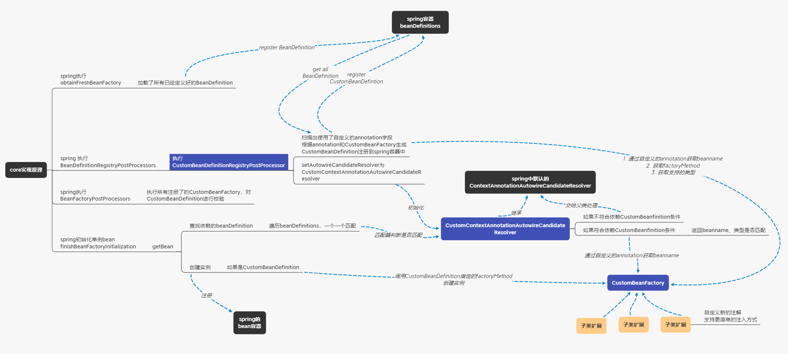

# jrymos-spring-custom-injection
这是一款轻量级（core代码不到300行，所有代码含测试代码不到1000行）自定义spring注入，先看个demo

demo1: 线程池的创建简化：
```
//说明：注入的线程池生命周期将交给spring管理，spring在destroy销毁bean时调用线程池的shutdown方法
@Service
@RequiredArgsConstructor
public class XxxService {

    //注入一个默认配置的线程池
    @ThreadPoolConfig(id = "pool1")
    private final ThreadPoolExecutor threadPoolExecutor;

    //注入一个核心线程数=2、队列大小为999的线程池
    @ThreadPoolConfig(id = "pool2", coreS = 2, qSize = 999)
    private final Executor executor;

    //注入一个最大线程数=10，同步队列，拒绝策略采用忽略
    @ThreadPoolConfig(id = "pool3", maxS = 10, qSize = 0, reject = ThreadPoolExecutor.DiscardPolicy.class)
    private final ExecutorService executorService;

    //注入一个线程池列表，包含所有的线程池
    private final List<ExecutorService> executorServices;

    //注入一个线程池列表，只包含id=pool1、pool2的线程池
    @CccCollection(value = {"pool1", "pool2"}, prefixClass = ThreadPoolFactory.class)
    private final List<ExecutorService> executorServices2;

    //注入一个线程池map，key为pool1、pool3，线程池id为pool1、pool3的线程池
    @CccMap(value = {"pool1", "pool3"}, prefixClass = ThreadPoolFactory.class)
    private final Map<String, ExecutorService> executorServices3;
}
```

这是一款轻量级，通过注解生成自定义的beanDefinition、动态Factory创建bean注入到spring容器，优势：
1. 非常方便开发，减少各种service构造函数中new对象（符合依赖倒置原则）
2. 解决多个service构造函数中new一个本应该是单例的对象，导致容易出错
3. 将bean的生命周期交给spring管理，减少漏释放资源导致的bug
4. 非常容易扩展，实现自己想要的定制化功能只需要继承CustomBeanFactory抽象类，并实现抽象方法即可

demo2: 更强大的集合的注入：
```
public class XxxService {

    //传统方式，注入所有的animal
    private final Map<String, Animal> animalMap; 
    private final Set<Animal> animalSet;

    //增强的注入方式，支持指定key的获取
    @CccMap(keyMethod = "getClass")
    private final Map<Class<? extends Animal>, Animal> map1;
    //支持注入的map只包含指定的元素
    @CccMap(value = {"duck", "cat"})
    private final Map<String, Animal> map2;
    //同时支持前面两种
    @CccMap(value = {"bird", "duck"}, keyMethod = "getClass")
    private final Map<Class<? extends Animal>, Animal> map3;
    //支持注入的value类型设置为任意类型
    @CccMap(value = {"water", "cat"})
    private final Map<String, Object> map4;


    @CccCollection
    private final Collection<Animal> empty;
    @CccCollection("water")
    private final Collection<Water> collection;
    @CccCollection("water")
    private final List<Water> list;
    @CccCollection({"water", "cat", "bird"})
    private final Set<Object> set;
    @CccCollection({"bird", "duck", "cat"})
    private final TreeSet<Animal> treeSet;
}
```

demo3: redisson的RObject创建简化：
```
@Service
@RequiredArgsConstructor
public class XxxService {

    @RedissonKey(redisKey = "hello")
    private final RBucket<Long> longRBucket;

    // rBucket == longRBucket， 使用相同的redisKey, spring注入的是同一个实例
    // 在注入之前spring会对类型进行检查，极大的减少自己new一个RBucket出现了重复key但是类型不同导致bug
    @RedissonKey(redisKey = "hello")
    private final RBucket<Long> rBucket;

    @RedissonKey(redisKey = "testList")
    private final RList<Long> longRList;

    @RedissonKey(redisKey = "map")
    private final RMap<String, Long> stringLongRMap;
}
```

demo4: MemcachedLock创建简化：
```
@Service
@RequiredArgsConstructor
public class XxxService {

    @MemcachedLockConfig(identify = "lock1", expSecs = 2)
    private final MemcachedLock memcachedLock11;

    /**
     * 将会使用memcachedLock11的expSecs
     * @see cn.jrymos.spring.custom.injection.memcached.MemcachedLockFactory#checkAndUpdateCustomFactoryMethodParameter(CustomFactoryMethodParameter) 重写了检查
     */
    @MemcachedLockConfig(identify = "lock1")
    private final MemcachedLock memcachedLock1;

    /**
     * @see cn.jrymos.spring.custom.injection.memcached.MemcachedLockFactory#getMemcachedLock(CustomFactoryMethodParameter, MemCachedClient) 使用默认的10s
     */
    @MemcachedLockConfig(identify = "lock2")
    private final MemcachedLock memcachedLock2;

}
```

demo5: 支持spring所能支持的任意一种注入方式：
```
@Service
public class XxxService {
    // 通过构造函数参数注入
    public XxxService(@ThreadPoolExecutorConfig(threadPoolId = "executor1") ExecutorService executor1) {
        
    }
}


@Configuration
public class XxxConfig {

    //通过方法参数注入
    @Bean
    public XxxConfigService xxxConfigService(@ThreadPoolExecutorConfig(threadPoolId = "hello") ThreadPoolExecutor threadPoolExecutor) {
        return new XxxConfigService(threadPoolExecutor);
    }
}

public class XxxBiz {
    // 通过autowired注入
    @ThreadPoolExecutorConfig(corePoolSize = 2, maximumPoolSize = 2, keepAliveTime = 1,
        timeUnit = TimeUnit.SECONDS, queueSize = 1, threadPoolId = "threadPoolExecutor")
    @Autowired
    private ThreadPoolExecutor threadPoolExecutor;
}

// 最强大的方式：支持final字段结合lombok的@RequiredArgsConstructor注入
@Service
@RequiredArgsConstructor
public class XxxBiz2 {
    @ThreadPoolExecutorConfig(corePoolSize = 2, maximumPoolSize = 2, keepAliveTime = 1,
        timeUnit = TimeUnit.SECONDS, queueSize = 1, threadPoolId = "threadPoolExecutor")
    private final ThreadPoolExecutor threadPoolExecutor;
}
```


### 如何使用？
把源码下载下来，可以直接运行里面的所有测试方法，看看效果。
```
    <modules>
        <!--    核心模块    -->
        <module>core</module>
        <!--    自动注入RObject实现 demo模块    -->
        <module>redisson</module>
        <!--    自动注入MemcachedLock实现 demo模块    -->
        <module>memcached</module>
        <!--    自动注入ThreadPoolExecutor实现 demo模块    -->
        <module>threadpool</module>
        <!--    自动注入Collection、List、Set、Map实现 demo模块    -->
        <module>ccc</module>
    </modules>
```
一共有5个模块，除了core以外其他都不是必须的，不需要的可以删掉，也可以进行二次开发，也可以扩展新的模块，非常的轻量级。

### 二次开发扩展：继承下面的抽象类，按照你的需要，重写一些方法，就能实现自定义的注入功能
可以参考：ThreadPoolFactory、RedissonObjectFactory、MemcachedLockFactory、CccCollectionFactory、CccMapFactory
```
/**
 * 自定义注解的实例工厂
 * 每次新增自定义注解，只需要继承CustomBeanFactory, 子类应该保证是空的构造函数,子类可以通过@Configuration注册到spring中，也可以调用CustomBeanFactoryRegister.register注册
 * 相关demo:
 * @see ThreadPoolFactory
 * @see RedissonObjectFactory
 * @see MemcachedLockFactory
 * @see CustomBeanFactoryRegister#register(CustomBeanFactory)
 * @param <T> 注解的元注解至少应该有@Target({ElementType.FIELD})、@Retention(RetentionPolicy.RUNTIME)
 */
@Slf4j
public abstract class CustomBeanFactory<T extends Annotation, R> implements BeanFactoryPostProcessor, BeanNamePrefix, Ordered {

    /**
     * 自定义注解class类型
     */
    public abstract Class<T> getAnnotationType();

    /**
     * 获取bean标识的值
     * such as:
     * @see ThreadPoolConfig#id
     * @see CccCollection#hashcode
     * @see RedissonKey#redisKey
     * @see MemcachedLockConfig#identify
     */
    public abstract String getBeanValue(T annotation);

    /**
     * 获取工厂方法， 支持重写以传递更多的参数（只要是spring bean都支持传，无需做额外处理）
     * 工厂方法需要满足的条件：
     * @see CustomFactoryMethodParameter 第一个参数是CustomFactoryMethodParameter
     * @see this#getBeanClass() 返回结果是要生产的bean实例
     * @see cn.jrymos.spring.custom.injection.redisson.RedissonObjectBeanFactory 重写了getFactoryMethod，传RedissonClient
     */
    @SneakyThrows
    public Method getFactoryMethod() {
        return getClass().getMethod("factoryMethod", CustomFactoryMethodParameter.class);
    }

    /**
     * 如果没有重写getFactoryMethod，那就一定要重写factoryMethod
     * 如果重写了getFactoryMethod，那就没有任何必要重写factoryMethod了
     */
    public R factoryMethod(CustomFactoryMethodParameter<T> customFactoryMethodParameter) {
        //such as: return customFactoryMethodParameter.getBeanClass().newInstance();
        throw new UnsupportedOperationException("not implements");
    }
}
```

### core模块的实现原理
